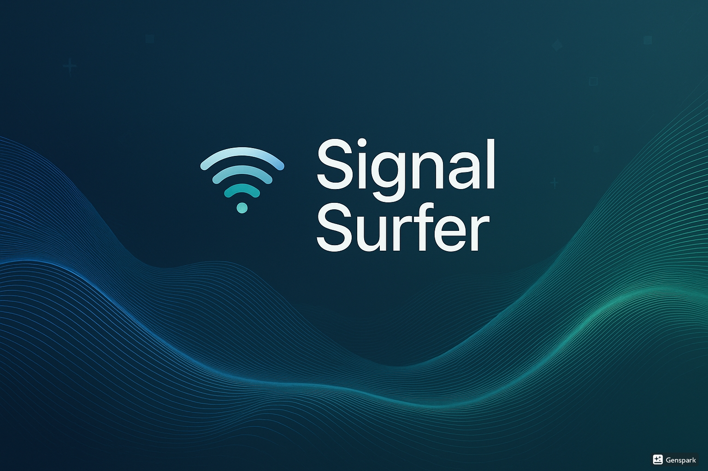

# Signal Surfer

**Signal Surfer** is a macOS desktop application that visualizes your current Wi-Fi signal strength using dynamic animations.

---

## Features

- Real-time detection of Wi-Fi signal strength using macOS's CoreWLAN framework
- Visual feedback with animations that vary depending on signal strength levels
- Lightweight UI application packaged with PyInstaller

---

# Installation

## For a quick and easy installation
run the following command in your terminal:

```bash
curl -sL https://raw.githubusercontent.com/j341nono/SignalSurfer/main/install.sh | bash
```

## manually

Alternatively, you can clone the repository and build the app manually:

```bash
git clone git@github.com:j341nono/SignalSurfer.git
cd SignalSurfer

uv sync
source .venv/bin/activate

# Build the app
pyinstaller --onefile --windowed --name="WiFi Signal Visualizer" --icon=assets/app.icns main.py

deactivate
```
Requires Python 3.8+ and pyinstaller installed in your environment.

## Usage
After building, navigate to the dist/ directory:

- `cd dist/`
- Double-click on WiFi Signal Visualizer to launch the app.

# Technologies Used for Wi-Fi Information Retrieval
There are several methods available to retrieve Wi-Fi-related information such as SSID and RSSI on macOS. The following options were considered:

### airport Command-Line Tool (Deprecated)
The airport tool is a command-line utility that provides detailed Wi-Fi information, including RSSI, SSID, BSSID, and more.

- Pros
    - Easy to use via terminal or subprocess calls.
    - Provides detailed and structured information.
- Cons
    - Deprecated by Apple and may be removed in future macOS releases.
    - Not officially supported or documented.

Inconsistent behavior across OS versions.

Reason for rejection:

Due to its deprecation status and lack of future support, airport is not a sustainable option for long-term use.

### Wireless Diagnostics (wdutil)
The wdutil command is the official command-line interface for Wireless Diagnostics, introduced in newer versions of macOS.

- Pros
    - Officially provided by Apple.
    - Offers comprehensive diagnostics and Wi-Fi environment info.
- Cons
    - Requires sudo for most commands, including info.
    - Not script-friendly due to privilege escalation and GUI prompts.

Available only on recent macOS versions (e.g., Monterey and later).

Reason for partial rejection:

While reliable and up-to-date, the need for elevated privileges (sudo) limits its use in automated or GUI-based applications.

### CoreWLAN Framework (Selected)
CoreWLAN is a native macOS framework that allows direct access to Wi-Fi interfaces via Objective-C or Python (via PyObjC).

- Pros
    - Fully supported and documented API by Apple.
    - No need for sudo or terminal-based workarounds.

Compatible with GUI applications and scripting.

Returns structured Wi-Fi information such as SSID, RSSI, BSSID, etc.

- Cons
    - Requires use of Objective-C, Swift, or PyObjC (Python bridge).

Reason for selection:

CoreWLAN provides a secure, stable, and future-proof way to access Wi-Fi information without requiring elevated privileges. It integrates well with Python via PyObjC and is suitable for both command-line tools and GUI applications.